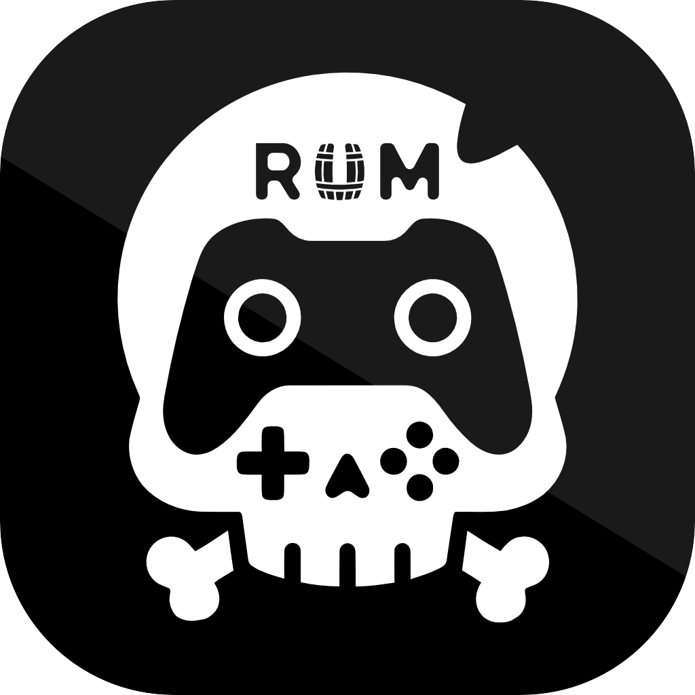

<div align="center">



  # Rum 
  *Wine but a bit sweeter*

  [](https://github.com/adrianlungu/rum)
</div>

Rum is a fork of [Whisky](https://github.com/Whisky-App/Whisky), updated to use [Gcenx's Wine Staging](https://github.com/Gcenx/macOS_Wine_builds) builds and [DXVK-macOS](https://github.com/Gcenx/DXVK-macOS) for DirectX translation.

---

Rum provides a clean and easy to use graphical wrapper for Wine built in native SwiftUI. You can make and manage bottles, install and run Windows apps and games, and unlock the full potential of your Mac with no technical knowledge required.

---

## Install

### Homebrew

```bash
brew tap lunguini/tap
brew install --cask rum
```

### Manual

Download the latest `Rum.zip` from the [Releases](https://github.com/adrianlungu/rum/releases) page, extract it, and move `Rum.app` to your Applications folder.

> **Note:** Since the app is not notarized, macOS will block it on first launch. Right-click the app → **Open**, then click **Open** in the dialog. You only need to do this once.

## System Requirements
- CPU: Apple Silicon (M-series chips)
- OS: macOS Tahoe 26.0 or later

## Credits & Acknowledgments

Rum is possible thanks to the magic of several projects:

- [Wine Staging](https://github.com/Gcenx/macOS_Wine_builds) by Gcenx
- [DXVK-macOS](https://github.com/Gcenx/DXVK-macOS) by Gcenx and doitsujin
- [MoltenVK](https://github.com/KhronosGroup/MoltenVK) by KhronosGroup
- [Sparkle](https://github.com/sparkle-project/Sparkle) by sparkle-project
- [SemanticVersion](https://github.com/SwiftPackageIndex/SemanticVersion) by SwiftPackageIndex
- [swift-argument-parser](https://github.com/apple/swift-argument-parser) by Apple
- [SwiftTextTable](https://github.com/scottrhoyt/SwiftyTextTable) by scottrhoyt

Originally based on [Whisky](https://github.com/Whisky-App/Whisky) by Isaac Marovitz. Special thanks to Gcenx for Wine and DXVK macOS builds, and to CodeWeavers and WineHQ for their foundational work.
