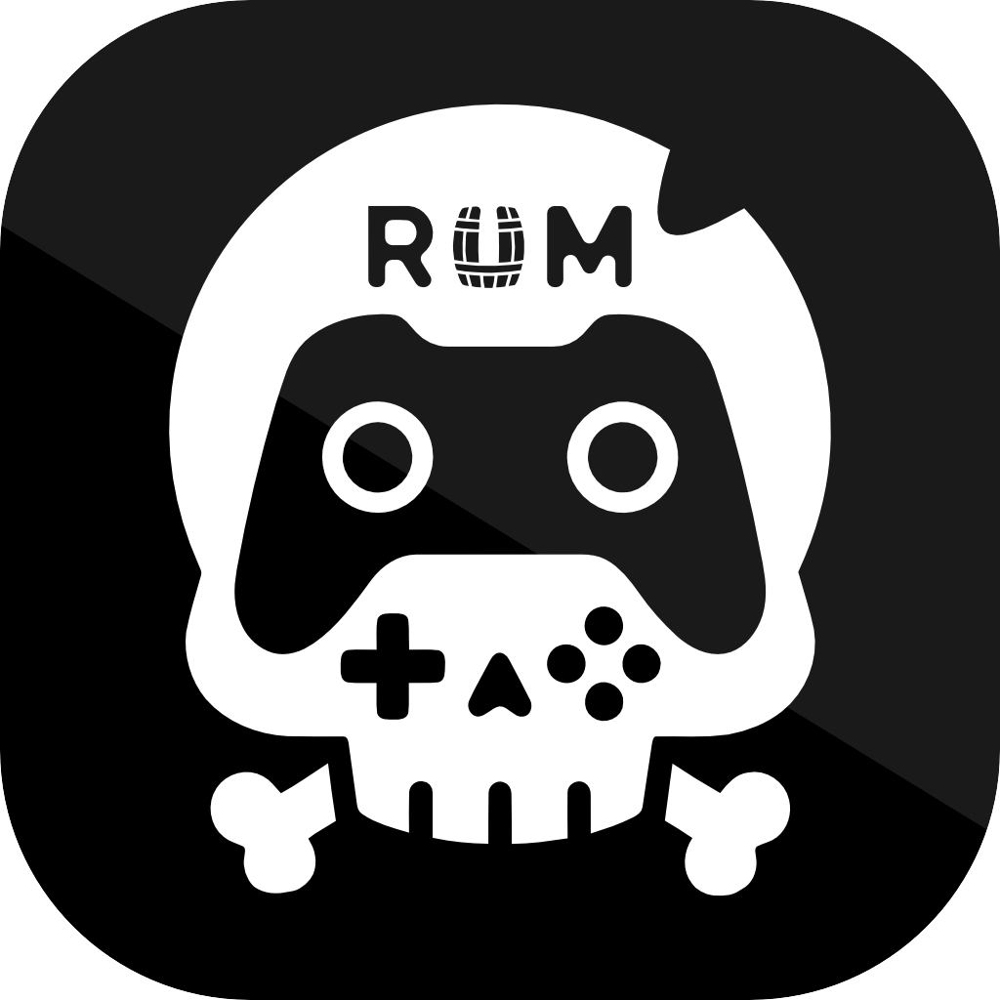

<div align="center">



  # Rum 
  *Wine but a bit sweeter*


</div>

Rum is a fork of [Whisky](https://github.com/Whisky-App/Whisky), updated to use [Gcenx's Wine Staging](https://github.com/Gcenx/macOS_Wine_builds) builds and [DXVK-macOS](https://github.com/Gcenx/DXVK-macOS) for DirectX translation.

---

Rum provides a clean and easy to use graphical wrapper for Wine built in native SwiftUI. You can make and manage bottles, install and run Windows apps and games, and unlock the full potential of your Mac with no technical knowledge required.

---

## Graphics backends

New bottles use DXVK by default when it is installed; otherwise they start with WineD3D. A bottle can also use WineD3D, DXMT, or D3DMetal when its selected Wine engine provides the matching runtime. DXMT and D3DMetal currently require 64-bit bottles; Rum verifies the selected engine and renderer payload before launch.

Rum does not download or redistribute Apple's D3DMetal runtime. Import a compatible Game Porting Toolkit installation or use an external engine that already provides it, subject to the applicable Apple license.

### Wine engines

Wine Manager keeps Gcenx and Sikarugir engines side by side. Install an engine once, then choose
the engine for each bottle under Configuration → Runtime. Existing bottles follow the global
default until they are pinned; changing the global default does not rewrite bottle selections.
Sikarugir engine archives provide the Wine tree; DXMT is installed separately from Wine Manager
as a shared renderer payload from the [official DXMT releases](https://github.com/3Shain/dxmt/releases)
and is enabled only when the selected Wine tree is compatible.

### Automated renderer validation

Run `make test` for the deterministic WhiskyKit suite. On a Mac with CrossOver installed, `make graphics-canary` creates disposable prefixes, stages the installed DXMT/D3DMetal payloads, and verifies that Wine can load D3D11 without touching a real bottle. Set the `RUM_GRAPHICS_CANARY_ENABLED` repository variable to `true` to run the required canaries automatically on a self-hosted `macOS`/`rum-graphics` runner in CI.

---

## Install

### Homebrew

```bash
brew tap lunguini/tap
brew install --cask rum
```

### Manual

Download the latest `Rum.zip` from the [Releases](https://github.com/adrianlungu/rum/releases) page, extract it, and move `Rum.app` to your Applications folder.

> **Note:** Since the app is not notarized, macOS will block it on first launch. Right-click the app → **Open**, then click **Open** in the dialog. You only need to do this once.

## System Requirements
- CPU: Apple Silicon (M-series chips)
- OS: macOS Tahoe 26.0 or later

## Credits & Acknowledgments

Rum is possible thanks to the magic of several projects:

- [Wine Staging](https://github.com/Gcenx/macOS_Wine_builds) by Gcenx
- [DXVK-macOS](https://github.com/Gcenx/DXVK-macOS) by Gcenx and doitsujin
- [DXMT](https://github.com/3Shain/dxmt) by 3Shain
- [Sikarugir engines](https://github.com/Sikarugir-App/Engines) by the Sikarugir/Gcenx community
- [Game Porting Toolkit](https://developer.apple.com/games/game-porting-toolkit) and D3DMetal by Apple
- [MoltenVK](https://github.com/KhronosGroup/MoltenVK) by KhronosGroup
- [Sparkle](https://github.com/sparkle-project/Sparkle) by sparkle-project
- [SemanticVersion](https://github.com/SwiftPackageIndex/SemanticVersion) by SwiftPackageIndex
- [swift-argument-parser](https://github.com/apple/swift-argument-parser) by Apple
- [SwiftTextTable](https://github.com/scottrhoyt/SwiftyTextTable) by scottrhoyt

Originally based on [Whisky](https://github.com/Whisky-App/Whisky) by Isaac Marovitz. Special thanks to Gcenx for Wine and DXVK macOS builds, and to CodeWeavers and WineHQ for their foundational work.
